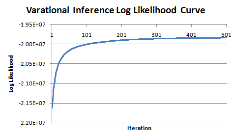

# Experiment 1 #

raw_corpus/part-00000

num_docs: 45w

num_topics: 100

vocab_size: 106000

num_mappers: 100

num_reducers: 20

total_iterations: 500

time: 33h15min

    ~/peacock/Mr.LDA> nohup hadoop jar Mr.LDA-0.0.1.jar cc.mrlda.VariationalInference \
      -input /user/test/xueminzhao/mrlda/sosoquerylog/corpus/document \
      -output /user/test/xueminzhao/mrlda/sosoquerylog/train \
      -term 106000 \
      -topic 100 \
      -iteration 500 \
      -mapper 100 \
      -reducer 20 \
      -localmerge \
      >vi.log 2>&1 &

[topic top words of iteration 40](ttw/exp1-ttw.40)

[topic top words of iteration 100](ttw/exp1-ttw.100)

[topic top words of iteration 200](ttw/exp1-ttw.200)

[topic top words of iteration 500](ttw/exp1-ttw.500)

# Experiment 2 #

## raw_corpus/part-00[0,1]* ##

num_docs: 94,787,423

vocab_size: 275,027

    ~/peacock/Mr.LDA2> nohup hadoop jar Mr.LDA-0.0.1.jar cc.mrlda.VariationalInference \
      -input /user/test/xueminzhao/mrlda/sosoquerylog2/corpus/document \
      -output /user/test/xueminzhao/mrlda/sosoquerylog2/train \
      -term 275027 \
      -topic 1000 \
      -iteration 300 \
      -mapper 100 \
      -reducer 20 \
      -localmerge \
      >vi.log 2>&1 &  

出现OOM错误:

    13/03/26 10:00:53 INFO mapred.JobClient: Running job: job_201303110957_8522
    13/03/26 10:00:54 INFO mapred.JobClient:  map 0% reduce 0%
    13/03/26 10:13:54 INFO mapred.JobClient:  map 1% reduce 0%
    13/03/26 10:25:56 INFO mapred.JobClient:  map 2% reduce 0%
    13/03/26 10:37:55 INFO mapred.JobClient:  map 3% reduce 0%
    13/03/26 10:49:53 INFO mapred.JobClient:  map 4% reduce 0%
    13/03/26 11:01:53 INFO mapred.JobClient:  map 5% reduce 0%
    13/03/26 11:14:00 INFO mapred.JobClient:  map 6% reduce 0%
    13/03/26 11:26:04 INFO mapred.JobClient:  map 7% reduce 0%
    13/03/26 11:38:09 INFO mapred.JobClient:  map 8% reduce 0%
    13/03/26 11:45:37 INFO mapred.JobClient: Task Id : attempt_201303110957_8522_m_000094_0, Status : FAILED
    Error: Java heap space
    attempt_201303110957_8522_m_000094_0: ======================================================================
    attempt_201303110957_8522_m_000094_0: Available processors (cores): 16
    attempt_201303110957_8522_m_000094_0: Maximum memory (bytes): 954466304
    attempt_201303110957_8522_m_000094_0: Free memory (bytes): 6426440
    attempt_201303110957_8522_m_000094_0: Total memory (bytes): 118554624
    attempt_201303110957_8522_m_000094_0: ======================================================================
    attempt_201303110957_8522_m_000094_0: Term 21941 not found in the corresponding beta matrix...
    
## raw_corpus/part-000* ##

    ~/peacock/Mr.LDA2> nohup hadoop jar Mr.LDA-0.0.1.jar cc.mrlda.ParseCorpus \
      -input /user/test/xueminzhao/mrlda/sosoquerylog2/raw_corpus \
      -output /user/test/xueminzhao/mrlda/sosoquerylog2/corpus \
      >parse-corpus.log &
    
num_docs: 47,412,397

vocab_size: 268,049

    ~/peacock/Mr.LDA2> nohup hadoop jar Mr.LDA-0.0.1.jar cc.mrlda.VariationalInference \
      -input /user/test/xueminzhao/mrlda/sosoquerylog2/corpus/document \
      -output /user/test/xueminzhao/mrlda/sosoquerylog2/train \
      -term 268049 \
      -topic 800 \
      -iteration 300 \
      -mapper 100 \
      -reducer 20 \
      -localmerge >vi.log 2>&1 & 

最后结果一样, 都failed, 同时尝试了num_topics=500和300.

## raw_corpus/part-000[0~4]* ##

num_docs: 23713016

vocab_size: 254024

num_topics=500, failed.

## raw_corpus/part-000[0,1]* ##

num_docs: 1423,1407

vocab_size: 238982

num_topics=500/400, failed:

    13/03/28 13:43:19 INFO mrlda.VariationalInference: Log likelihood after iteration 1 is -1.0309106762E8
    13/03/28 13:43:19 INFO mapred.FileInputFormat: Total input paths to process : 120
    13/03/28 13:43:23 INFO mapred.JobClient: Running job: job_201303110957_9352
    13/03/28 13:43:24 INFO mapred.JobClient:  map 0% reduce 0%
    13/03/28 13:50:56 INFO mapred.JobClient: Task Id : attempt_201303110957_9352_m_000003_0, Status : FAILED
    java.lang.RuntimeException: Error in configuring object
            at org.apache.hadoop.util.ReflectionUtils.setJobConf(ReflectionUtils.java:93)
            at org.apache.hadoop.util.ReflectionUtils.setConf(ReflectionUtils.java:64)
            at org.apache.hadoop.util.ReflectionUtils.newInstance(ReflectionUtils.java:117)
            at org.apache.hadoop.mapred.MapTask.runOldMapper(MapTask.java:354)
            at org.apache.hadoop.mapred.MapTask.run(MapTask.java:307)
            at org.apache.hadoop.mapred.Child.main(Child.java:159)
    Caused by: java.lang.reflect.InvocationTargetException
            at sun.reflect.NativeMethodAccessorImpl.invoke0(Native Method)
            at sun.reflect.NativeMethodAccessorImpl.invoke(NativeMethodAccessorImpl.java:39)
            at sun.reflect.DelegatingMethodAccessorImpl.invoke(DelegatingMethodAccessorImpl.java:25)
            at java.lang.reflect.Method.invoke(Method.java:597)
            at org.apache.hadoop.util.ReflectionUtils.setJobConf(ReflectionUtils.java:88)
            ... 5 more
    Caused by: java.lang.RuntimeException: Error in configuring object
            at org.apache.hadoop.util.ReflectionUtils.setJobConf(ReflectionUtils.java:93)
            at org.apache.hadoop.util.ReflectionUtils.setConf(ReflectionUtils.java:64)
            at org.apache.hadoop.util.ReflectionUtils.newInstance(ReflectionUtils.java:117)
            at org.apache.hadoop.mapred.MapRunner.configure(MapRunner.java:34)
            ... 10 more
    Caused by: java.lang.reflect.InvocationTargetException
            at sun.reflect.NativeMethodAccessorImpl.invoke0(Native Method)
            at sun.reflect.NativeMethodAccessorImpl.invoke(NativeMethodAccessorImpl.java:39)
            at sun.reflect.DelegatingMethodAccessorImpl.invoke(DelegatingMethodAccessorImpl.java:25)
            at java.lang.reflect.Method.invoke(Method.java:597)
            at org.apache.hadoop.util.ReflectionUtils.setJobConf(ReflectionUtils.java:88)
            ... 13 more
    Caused by: java.lang.OutOfMemoryError: Java heap space
            at cc.mrlda.DocumentMapper.importBeta(DocumentMapper.java:486)
            at cc.mrlda.DocumentMapper.configure(DocumentMapper.java:108)
            ... 18 more

## raw_corpus/part-0000* ##

> num_docs: 9,488,902

> vocab_size: 225,085

> num_topics: 200

> num_mappers: 100

> num_reducers: 20

### Mr.LDA ###

    hadoop jar Mr.LDA-0.0.1.jar cc.mrlda.VariationalInference \
      -input /user/test/xueminzhao/mrlda/sosoquerylog2/corpus/document \
      -output /user/test/xueminzhao/mrlda/sosoquerylog2/train2 \
      -term 225085 \
      -topic 200 \
      -iteration 170 \
      -mapper 100 \
      -reducer 20 \
      -localmerge \
      >vi.log 2>&1

### Peacock ###

> num_vshards = 20

> num_machines = 3

> total_iterations = 300

### 实验结果 ###

