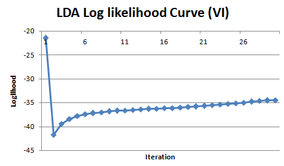

# 编译 #

从`https://github.com/lintool/Mr.LDA`下载并编译:

    qkjd@qkjd-virtual-machine:~/proj/thirdparty$ git clone http://github.com/lintool/Mr.LDA.git 
    Cloning into 'Mr.LDA'...
    remote: Counting objects: 640, done.
    remote: Compressing objects: 100% (230/230), done.
    remote: Total 640 (delta 270), reused 624 (delta 255)
    Receiving objects: 100% (640/640), 244.05 KiB | 110 KiB/s, done.
    Resolving deltas: 100% (270/270), done.
    
    qkjd@qkjd-virtual-machine:~/proj/thirdparty$ cd Mr.LDA/
    qkjd@qkjd-virtual-machine:~/proj/thirdparty/Mr.LDA$ ant
    ...
    BUILD SUCCESSFUL
    Total time: 4 seconds
  
    qkjd@qkjd-virtual-machine:~/proj/thirdparty/Mr.LDA$ ant export
    ...
    export:
      Building jar: /home/cocktail/proj/soft/Mr.LDA/bin/Mr.LDA-0.0.1.jar

    BUILD SUCCESSFUL
    Total time: 38 seconds
  
    qkjd@qkjd-virtual-machine:~/proj/thirdparty/Mr.LDA$ ll bin
    total 22438
    -rw-r--r-- 1 cocktail users 22951880 2013-03-20 17:12 Mr.LDA-0.0.1.jar

# 准备语料 #

Mr. LDA takes raw text file as input, every row in the text file represents a stand-alone document. 
Document title and content are separated by a tab ('\t'), and words in the content are 
separated by a space (' '). The raw input text file should look like this:

    'Big Bang Theory' Brings Stephen Hawking on as Guest Star	'The Big Bang Theory' is getting a visit from Stephen Hawking. The renowned theoretical physicist will guest-star on the April 5 episode of the CBS comedy, the network said Monday. In the cameo, Hawking visits uber-geek Sheldon Cooper (Jim Parsons) at work 'to share his beautiful mind with his most ardent admirer,' according to CBS. Executive producer Bill Prady said that having Hawking on the show had long been a goal, though it seemed unattainable. When people would ask us who a dream guest star' for the show would be, we would always joke and say Stephen Hawking knowing that it was a long shot of astronomical proportions, Prady said. In fact, we're not exactly sure how we got him. It's the kind of mystery that could only be understood by, say, a Stephen Hawking. Hawking, known for his book A Brief History of Time, has appeared on television comedies before, albeit in voice work. Hawking has done a guest spot on 'Futurama' and appeared as himself on several episodes of 'The Simpsons.'
    The World's Best Gourmet Pizza: 'Tropical Pie' Wins Highest Honor	To make the world's best pizza you'll need dough, mozzarella cheese and some top shelf tequila. On Thursday, top pizza-makers from around the globe competed for the title of 'World's Best Pizza' at the International Pizza Expo in Las Vegas. At stake was $10,000 and the highest honor in the industry. This year's big winner was anything but traditional. The 'Tropical Pie' - a blend melted asiago and mozzarella cheese, topped with shrimps, thinly sliced and twisted limes, a fresh mango salsa, all resting on a rich pineapple cream sauce infused with Patron. The recipe, devised by mad pizza scientist Andrew Scudera of Goodfella's Brick Oven Pizza in Staten Island, was months in the making.ame up with idea to use tequila, but it was a collaboration,' Andrew tells Shine. 'Everyone here at the restaurant dived in and gave their input, helping to perfect the recipe by the time we brought it to the show.' The competition in Vegas was steep-particularly in the 'gourmet' category, where the Tropical Pie was entered. 
  
将上述两个文档放到`test-corpus.txt`文件中, 得到测试使用的语料文件.
  
    test@TianJin-10-168-128-44:~/peacock/Mr.LDA> ll
    总计 22448
    -rw-r--r-- 1 test users 22951880 2013-03-20 14:27 Mr.LDA-0.0.1.jar
    -rw-r--r-- 1 test users     2147 2013-03-20 15:35 test-corpus.txt

### 中文支持 ###

为了与上述英文格式保持一致, 中文文档数据格式依然保持为:

* 一行表示一个Document;

* Document格式为`Title`\t`Content`;

* `Content`由tokens组成, tokens之间用` `分割, token中不允许包含` `.

示例如下`test-corpus.zh.txt`文件:

    doc0	苹果 电脑
    doc1	苹果 果汁
    doc2	苹果 电脑 ipad
    doc3	果汁 树
    doc4	电脑 ipad
    doc5	苹果 果汁 树
    doc6	电脑 ipad
    doc7	苹果 果汁 树
    doc8	电脑 ipad
    doc9	果汁 树

# 转化为训练程序需要格式 #

将文件`test-corpus.txt`上传到hdfs, 使用工具`ParseCorpus`生成训练程序`VariationalInference`需要的语料格式.
  
    hadoop fs -put test-corpus.txt /user/test/xueminzhao/mrlda/test/raw-corpus
  
    hadoop jar Mr.LDA-0.0.1.jar cc.mrlda.ParseCorpus \
     -input /user/test/xueminzhao/mrlda/test/raw-corpus/test-corpus.txt \
     -output /user/test/xueminzhao/mrlda/test/corpus
  
    hadoop fs -ls /user/test/xueminzhao/mrlda/test/corpus                                 
    Found 3 items
    drwxr-xr-x   -       0 2013-03-20 15:47 /user/test/xueminzhao/mrlda/test/corpus/document
    -rw-r--r--   3    5068 2013-03-20 15:46 /user/test/xueminzhao/mrlda/test/corpus/term
    -rw-r--r--   3     233 2013-03-20 15:46 /user/test/xueminzhao/mrlda/test/corpus/title
  
File `term` stores the mapping between a unique token and its unique integer ID. 
Similarly, `title` stores the mapping between a document title to its unique integer ID. 
Both of these two files are in sequence file format, key-ed by `IntWritable.java` and value-d by `Text.java`.

    hadoop jar Mr.LDA-0.0.1.jar edu.umd.cloud9.io.ReadSequenceFile \
      /user/test/xueminzhao/mrlda/test/corpus/term | more
    
    13/03/20 16:48:01 INFO util.NativeCodeLoader: Loaded the native-hadoop library
    13/03/20 16:48:01 INFO zlib.ZlibFactory: Successfully loaded & initialized native-zlib library
    13/03/20 16:48:01 INFO compress.CodecPool: Got brand-new decompressor
    Reading /user/test/xueminzhao/mrlda/test/corpus/term...

    Key type: class org.apache.hadoop.io.IntWritable
    Value type: class org.apache.hadoop.io.Text

    Record 0
    Key: 1
    Value: hawking
    ----------------------------------------
    Record 1
    Key: 2
    Value: pizza
    ----------------------------------------
  
    hadoop jar Mr.LDA-0.0.1.jar edu.umd.cloud9.io.ReadSequenceFile \
      /user/test/xueminzhao/mrlda/test/corpus/title
    
    Reading /user/test/xueminzhao/mrlda/test/corpus/title...

    Key type: class org.apache.hadoop.io.IntWritable
    Value type: class org.apache.hadoop.io.Text

    Record 0
    Key: 1
    Value: 'Big Bang Theory' Brings Stephen Hawking on as Guest Star
    ----------------------------------------
    Record 1
    Key: 2
    Value: The World's Best Gourmet Pizza: 'Tropical Pie' Wins Highest Honor
    ----------------------------------------
    2 records read.
  
The data format for Mr. LDA package is defined in `class Document.java`. 
It consists an `HMapII.java` object, storing all `word:count` pairs in a document using an `integer:integer` hash map. 
Take note that the word index starts from 1, whereas index 0 is reserved for system message.
  
    hadoop jar Mr.LDA-0.0.1.jar edu.umd.cloud9.io.ReadSequenceFile \
      /user/test/xueminzhao/mrlda/test/corpus/document/part-00000
    
    Reading /user/test/xueminzhao/mrlda/test/corpus/document/part-00000...

    Key type: class org.apache.hadoop.io.IntWritable
    Value type: class cc.mrlda.Document

    Record 0
    Key: 2
    Value: content: 2:6 8:2 12:2 14:2 15:2 17:2 16:2 ...
    gamma:  null
    ----------------------------------------
    1 records read.

### 中文支持 ###

修改ParseCorpus.java的如下部分:

    250       docContent = new HMapSIW();
    251       String doc_str = temp.substring(index + 1);
    252       String tokens[] = doc_str.split(String.valueOf(Settings.SPACE));
    253       for (int i = 0; i < tokens.length; ++i) {
    254         String s = tokens[i].trim();
    255         if (s == "") {
    256           continue;
    257         }
    258         docContent.increment(s);
    259       }
    260 
    261       /*
    262       stream = standardAnalyzer.tokenStream("contents,",
    263           new StringReader(temp.substring(index + 1)));
    264       TermAttribute termAttribute = stream.addAttribute(TermAttribute.class);
    265       while (stream.incrementToken()) {
    266         docContent.increment(termAttribute.term());
    267       }
    268       */
    269 
    270       outputTitle.collect(docTitle, NullWritable.get());
    271       outputDocument.collect(docTitle, docContent);

处理`test-corpus.zh.txt`后, term词典:

    hadoop jar Mr.LDA-0.0.1.jar edu.umd.cloud9.io.ReadSequenceFile \
      /user/test/xueminzhao/mrlda/test.zh/corpus/term 

    Reading /user/test/xueminzhao/mrlda/test.zh/corpus/term...

    Key type: class org.apache.hadoop.io.IntWritable
    Value type: class org.apache.hadoop.io.Text
    ...
    Record 4
    Key: 5
    Value: 树
    ----------------------------------------
    5 records read.

# 训练 #

训练工具为`VariationalInference`, 其支持`从原始语料开始训练`/`从之前暂停的任务恢复训练`/`使用Held-out数据Test模型`.

## 从原始语料开始训练 ##

`VariationalInference`支持的输入文件格式就是`ParseCorpus`的输出目录中的document目录下的文件格式.
  
    hadoop jar Mr.LDA-0.0.1.jar cc.mrlda.VariationalInference \
     -input /user/test/xueminzhao/mrlda/test/corpus/document \
     -output /user/test/xueminzhao/mrlda/test/train \
     -term 100 \
     -topic 2 \
     -iteration 30 \
     -mapper 2 \
     -reducer 2 \
     -localmerge
    
    ...
    13/03/20 18:06:34 INFO mrlda.VariationalInference: Log likelihood after iteration 9 is -980.11
    13/03/20 18:06:34 INFO mrlda.VariationalInference: Model converged after 9 iterations...
    
    hadoop fs -ls /user/test/xueminzhao/mrlda/test/train
    Found 21 items
    -rw-r--r--   3     135 2013-03-20 17:04 /user/test/xueminzhao/mrlda/test/train/alpha0
    -rw-r--r--   3     135 2013-03-20 17:04 /user/test/xueminzhao/mrlda/test/train/alpha1
    -rw-r--r--   3     135 2013-03-20 17:32 /user/test/xueminzhao/mrlda/test/train/alpha2
    -rw-r--r--   3     135 2013-03-20 17:45 /user/test/xueminzhao/mrlda/test/train/alpha3
    -rw-r--r--   3     135 2013-03-20 17:46 /user/test/xueminzhao/mrlda/test/train/alpha4
    -rw-r--r--   3     135 2013-03-20 17:46 /user/test/xueminzhao/mrlda/test/train/alpha5
    -rw-r--r--   3     135 2013-03-20 17:47 /user/test/xueminzhao/mrlda/test/train/alpha6
    -rw-r--r--   3     135 2013-03-20 17:48 /user/test/xueminzhao/mrlda/test/train/alpha7
    -rw-r--r--   3     135 2013-03-20 18:05 /user/test/xueminzhao/mrlda/test/train/alpha8
    -rw-r--r--   3     135 2013-03-20 18:06 /user/test/xueminzhao/mrlda/test/train/alpha9
    -rw-r--r--   3    2351 2013-03-20 17:22 /user/test/xueminzhao/mrlda/test/train/beta1
    -rw-r--r--   3    2352 2013-03-20 17:44 /user/test/xueminzhao/mrlda/test/train/beta2
    -rw-r--r--   3    2364 2013-03-20 17:45 /user/test/xueminzhao/mrlda/test/train/beta3
    -rw-r--r--   3    2333 2013-03-20 17:46 /user/test/xueminzhao/mrlda/test/train/beta4
    -rw-r--r--   3    1873 2013-03-20 17:47 /user/test/xueminzhao/mrlda/test/train/beta5
    -rw-r--r--   3     958 2013-03-20 17:48 /user/test/xueminzhao/mrlda/test/train/beta6
    -rw-r--r--   3     962 2013-03-20 18:04 /user/test/xueminzhao/mrlda/test/train/beta7
    -rw-r--r--   3     958 2013-03-20 18:05 /user/test/xueminzhao/mrlda/test/train/beta8
    -rw-r--r--   3     961 2013-03-20 18:06 /user/test/xueminzhao/mrlda/test/train/beta9
    drwxr-xr-x   -       0 2013-03-20 18:06 /user/test/xueminzhao/mrlda/test/train/gamma9
    drwxr-xr-x   -       0 2013-03-20 18:06 /user/test/xueminzhao/mrlda/test/train/temp
    
    hadoop fs -ls /user/test/xueminzhao/mrlda/test/train/gamma9
    Found 2 items
    -rw-r--r--   3 355 2013-03-20 18:05 /user/test/xueminzhao/mrlda/test/train/gamma9/gamma_gamma-m-00000
    -rw-r--r--   3 345 2013-03-20 18:05 /user/test/xueminzhao/mrlda/test/train/gamma9/gamma_gamma-m-00001

    hadoop fs -ls /user/test/xueminzhao/mrlda/test/train/temp
    Found 3 items
    -rw-r--r--   3       0 2013-03-20 18:06 /user/test/xueminzhao/mrlda/test/train/temp/_SUCCESS
    drwxr-xr-x   -       0 2013-03-20 18:05 /user/test/xueminzhao/mrlda/test/train/temp/_logs
    -rw-r--r--   3     138 2013-03-20 18:05 /user/test/xueminzhao/mrlda/test/train/temp/part-00001

# 其他 #

## Log Likelihood ##

在`VariationalInference`中会有logllhood的输出.

## Topic Top Words ##

Mr.LDA工具`DisplayTopic`可以输出topic top words, 但是程序有点问题: 模型训练beta保存成`HMapIFW`, 
但`DisplayTopic`解析时写为了`HMapIDW`, 简单修改后即可使用:

    45 import edu.umd.cloud9.io.map.HMapIDW;
    46 import edu.umd.cloud9.io.map.HMapIFW;
    47 import edu.umd.cloud9.io.pair.PairOfIntFloat;
    
    126       HMapIFW hmap = new HMapIFW();
    127       // HMapIDW hmap = new HMapIDW();
    
    142           double db = (double)(-hmap.get(temp1));
    143           treeMap.put(db, temp1);

Beta文件的格式应该是sequence file:

    key, type PairOfIntFloat, (topic-id,*) 
    value, type HMapIFW: value-key, type int, word-id; value-value, type float, p(w|z)

输出上述训练模型的topic top words:

    hadoop jar Mr.LDA-0.0.1.jar cc.mrlda.DisplayTopic \
     -index /user/test/xueminzhao/mrlda/test/corpus/term \
     -input /user/test/xueminzhao/mrlda/test/train/beta8 \
     -topdisplay 10
    
    ==============================
    Top ranked 10 terms for Topic 1
    ==============================
    pizza           1.7917594909667969
    cheese          0.6931471824645996
    ==============================
    Top ranked 10 terms for Topic 2
    ==============================
    hawking         1.945910096168518
    guest           1.0986123085021973
    say             0.6931471824645996

### 中文支持 ###

语料`test-corpus.zh.txt`的logllhood曲线为:

语料`test-corpus.zh.txt`的topic top words结果:

    hadoop jar Mr.LDA-0.0.1.jar cc.mrlda.DisplayTopic \
      -index /user/test/xueminzhao/mrlda/test.zh/corpus/term \
      -input /user/test/xueminzhao/mrlda/test.zh/train/beta10 \
      -topdisplay 10
    
    ==============================
    Top ranked 10 terms for Topic 1
    ==============================
    果汁		1.5244953632354736
    树		1.3317259550094604
    苹果		0.8660832047462463
    ==============================
    Top ranked 10 terms for Topic 2
    ==============================
    电脑		1.5543580055236816
    ipad		1.3614717721939087
    苹果		0.9640975594520569

xueminzhao
3/21/2013
